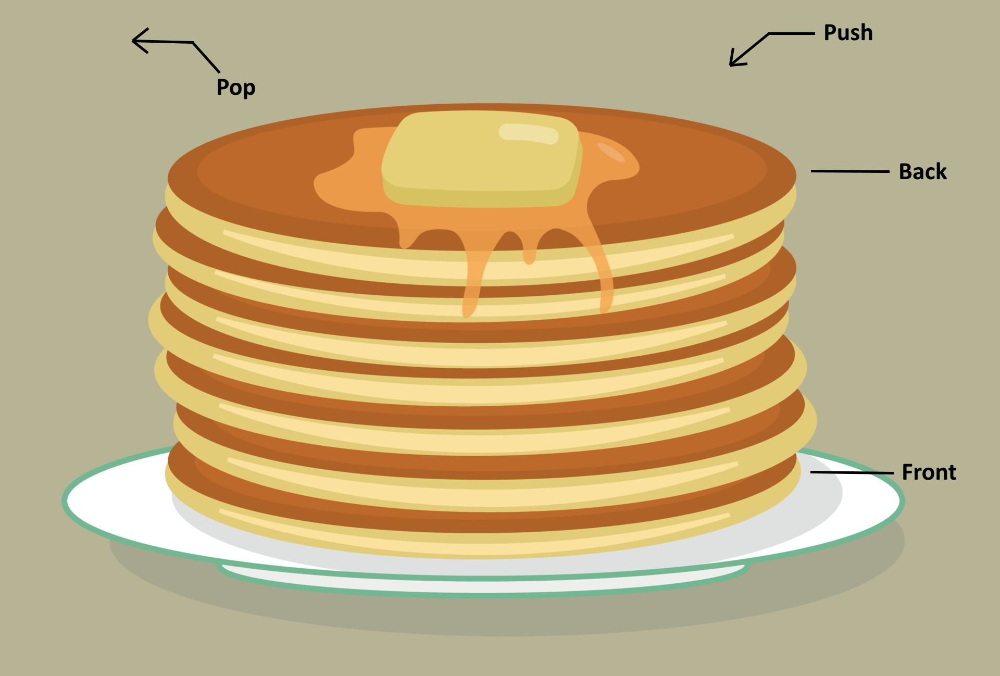

# Stacks

### Key Terms

- Front
- Back
- Push
- Pop

A stack is a data structure that uses "LIFO" (Last in, First out) to determine the order that data is entered and removed.
Chances are you've encountered stacks before, if you've ever messed up while writing a paper and had to undo your error. 

To understand stacks we can visualize them as a plate of pancakes. 
The "Front" of the stack would be the first pancake that was made, or the first item of data that was entered. 
The following data will then enter behind, essentially covering the data before it. 
The "Back" of the stack would be the most recent pancake that was made, or the last item of data that was entered.
When data is added to the stack, it is called a "Push", and is added to the back.
Whene data is removed from the stack, it is called a "Pop", and is removed from the back.

This is how we are able to press undo while writing a word document and it will remove the last action.
Let's say you write the sentence "The clouds moved and revealed the blue sky". The word "The" would be at the front of the stack, followed by "clouds", then "moved",
and so on. The word "sky" would be at the back of the stack. The undo button would pop "sky" and the word would be removed.

### Python Stacks

In Python, stacks can be defined using lists. The following table displays information about some common python functions regarding stacks.
Note that the performance of stacks is based on the performance of the dynamic array.

| Function          | Code              | Description          | Performance (in Big O)          |
| ----------------- | ----------------- | -------------------- | --------------------- |
| size() | size = len(stack) | return stack size | O(1)  |
| empty() | if len(stack) == 0 | returns whether the stack is empty | O(1)  |
| push() | stack.append(value) | adds item to the back of the stack | O(1)  |
| pop() | value = stack.pop() | return and remove item from the back of the stack | O(1)  |
| full() | print("Is full", stack.full()) | return whether the stack is at max size | O(1)  |

### Stacks and functions

Anytime we uses functions in our software, we are using a stack. Whenever we call a function in our code, there needs to be some 
kind of placeholder to remember where in the code you need to return to after the function has executed. This is why stacks are important.
After calling a function the computer is told to jump to that function and follow the instructions through. The computer then uses the back
of the stack as a reference for where to return in the code when it is done.
This works the same in the case that a call to a function is used inside another function. The original place in the code will always be
stored and wait for the function to finish executing.
The stack keeps track of when functions are called. This is helpful for errors and debugging because we can see where exactly the code encountered the problem.

## Examples

This will contain examples about the data structure

## Code Problem

This will contain a problem to solve with code

[Solution](stack-solution.py)

