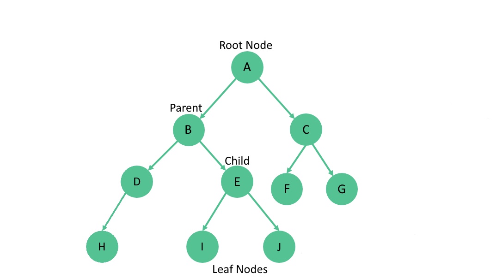
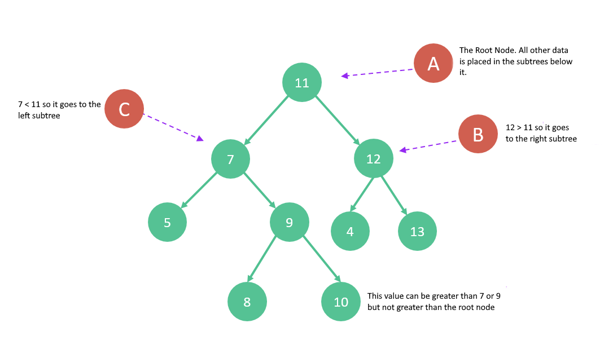

# Trees

Trees are similar to linked list in the sense that it uses nodes and pointers to connect them. The difference is that trees
can connect to multiple different nodes. In computing, trees are used for sorting and searching, becuse they provide a hierarchal structure.
We will take a look at a few different types of trees, as well as some of their common operations.

## Binary Tree

A `Binary Tree` is a type of tree where each node can have up to two connections to other nodes.\
The highest node in the tree is called the `Root Node`. There is always only one root node.\
Nodes with connected nodes are called `Parent Nodes`.\
The node that is connected to the parent is known as a `Child Node`.\
Nodes without any connected nodes are called `Leaf Nodes`.\
The group of nodes on the left or right side of the parent node form a `Subtree`




## Binary Search Tree

A `Binary Search Tree` (BST) is like a binary tree, but it follows specific rules for storing the data entered.
Data is stored in the BST by comparing it to the value of the parent node. When the data is of lower value than the parent,
it is stored in the left subtree. If the data is of greater value than the parent, it is stored in the right subtree. 
This process always starts at the root node, and continues until the data has found its place.



If we have a linked list or dynamic array containing values, we would have a performance of `O(n)` as we search for
the location to insert our data.
By incorporating a BST, we are increasing efficiency and performance; we are essentially removing a subtree per comparison.
This results in a better performance of `O(log n)`.

## Balanced Binary Search Tree

The reason we were able to achieve `O(log n)` above is because the tree was balanced. Binary search trees are not always balanced, however.
Say for example, we enter data into a tree in descending order like so: `33, 27, 23, 19, 15, 9`.
The tree would only be moving to the left. This is closer to a linked list, and has a searching perfomance of `O(n)`.
Because the data stored in trees will not always be balanced, there are ways we can check and correct
the balance.
A `Balanced Binary Search Tree` is a BST where the difference of height between two given subtrees is not vastly different.
A tree's height can be determined by counting the max number of nodes between the root and the leaves.

One way we can correct the balance of a tree is by using the AVL (Adelson-Velskii and Landis) tree algorithm.
When the tree detects that a node has exceeded a specific height and has unbalanced the tree, an automatic rotation is performed.
Where the node would have been placed, it instead takes the place of the parent node, and the original parent node and child node both
become child nodes of the new node. This sounds complicated but it is an easy process that eliminates the hassle of an unbalanced binary search tree.
An AVL tree will always be balanced, and so it will benefit from having an `O(log n)` performance.

## Common BST Python Functions

(Note) Python does not have built-in BST class functions.\
Packages for this functionality can be downloaded by other developers [here]([tree-solution.py](https://pypi.org/project/bintrees/)

## BST Operations

Let's look at some examples of common BST operations.

The first is Inserting into a BST.
Data will be insterted, using recursion, either to the left or the right depending on the value.
A root node will be determined if there is no value in the tree.

```Python
class Node:
    def __init__(self, val):
        self.val = val
        self.left = None
        self.right = None

def insert(root, val):
    if root is None:
        return Node(val)
    elif val < root.val:
        root.left = insert(root.left, val)
    else:
        root.right = insert(root.right, val)
    return root
```

The code in this example defines the Node as a class with a value and a left and right pointer.
The insert function grabs the root node and a value to insert.
If the root is empty, a new node is created with a value and returned.
If the value is less than the root, it is moved to the left subtree.
If the value it greater than the root, it is moved to the right subtree.

## Code Problem

This will contain a problem to solve with code

[Solution](tree-solution.py)

